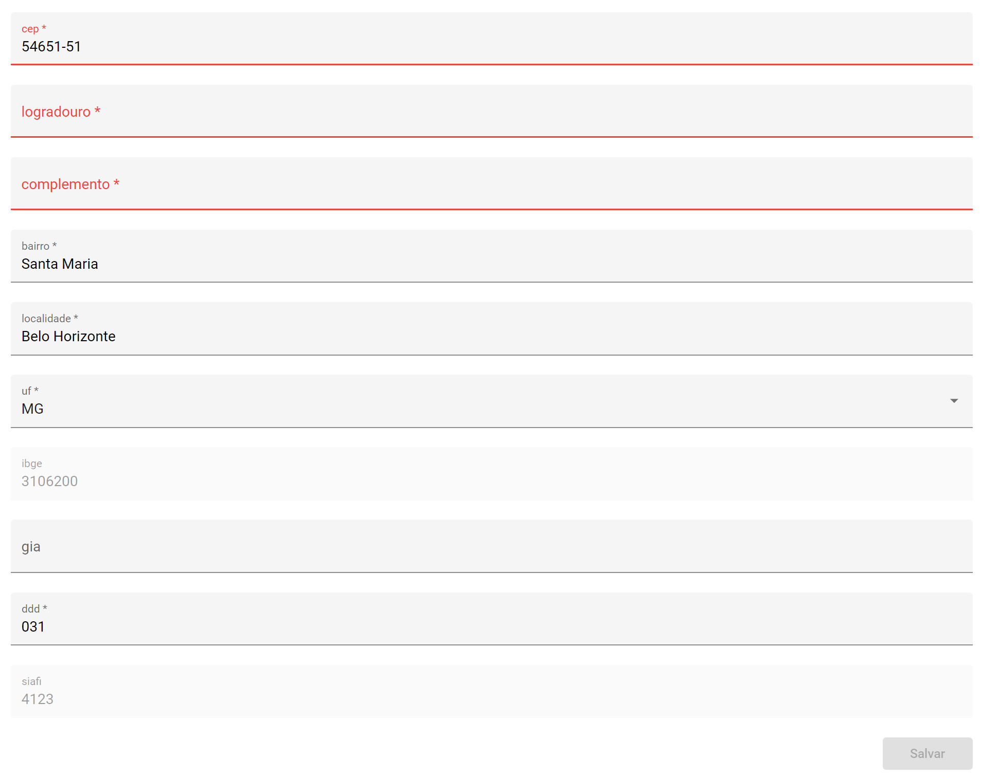
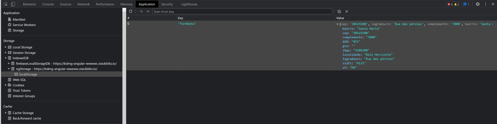

  

  

  
   

  

<h1 align="center">
  Angular request api and save localstorage
</h1>

<h4 align="center"> 
	🚧  Angular form 🖖 Concluído 🚀 🚧
</h4>

 <a href="#-sobre-o-projeto">Sobre</a> •
 <a href="#-funcionalidades">Funcionalidades</a> •
 <a href="#-como-executar-o-projeto">Como executar</a> • 
 <a href="#-tecnologias">Tecnologias</a> • 
 <a href="#-autor">Autor</a> • 
 <a href="#user-content--licença">Licença</a>

## 💻 Sobre o projeto

Este projeto em Angular inclui várias funcionalidades importantes que podem ser úteis no dia a dia de trabalho. O objetivo deste projeto é demonstrar a implementação de funcionalidades importantes em Angular e incentivar a sua reutilização em outros projetos.

---

## ⚙️Funcionalidades

- [x] Requisição de APIs
- [x] Formulário
- [x] Validação de campos do formulário
- [x] Uso de máscaras
- [x] Uso do localstorage

---

### Images

---

## 🚀 Como executar o projeto

3. Web (pasta do projeto) <a href="https://github.com/RodrigoJuniorLiyah/Angular-request-api-and-save-localstorage/archive/refs/heads/main.zip">baixe aqui</a>

### Pré-requisitos

Antes de começar, você vai precisar ter instalado em sua máquina as seguintes ferramentas:
[Git](https://git-scm.com), [Node.js](https://nodejs.org/en/).
Além disto é bom ter um editor para trabalhar com o código como [VSCode](https://code.visualstudio.com/)

---

## 🛠 Tecnologias

As seguintes ferramentas foram usadas na construção do projeto:

-   **[NGX-mask](https://www.npmjs.com/package/ngx-mask)**
-   **[NGX-PWA/localstorage](https://www.npmjs.com/package/@ngx-pwa/local-storage)**
-   **[Angular Material](https://material.angular.io/)**

> Veja o arquivo [package.json](https://github.com/RodrigoJuniorLiyah/Angular-request-api-and-save-localstorage/blob/main/package.json)

## 💪 Como contribuir para o projeto

1. Faça um **fork** do projeto.
2. Crie uma nova branch com as suas alterações: `git checkout -b my-feature`
3. Salve as alterações e crie uma mensagem de commit contando o que você fez: `git commit -m "feature: My new feature"`
4. Envie as suas alterações: `git push origin my-feature`

  > Caso tenha alguma dúvida confira este [guia de como contribuir no GitHub](./CONTRIBUTING.md)
---

## 🐱‍👤 Autor

 
 <b>Rodrigo Cabral 🚀</b>
  

 

---

## 📝 Licença

Este projeto esta sobe a licença [MIT](./LICENSE).

Feito com ❤️ por Rodrigo Junior 👋🏽 [Entre em contato!](https://www.linkedin.com/in/rodrigo-cabral-dev/)
